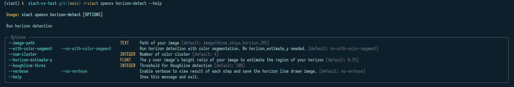

# viact-cv-test

This repository contains the solution to the Computer Vision test from viAct.

# Installation
- To install the script, clone the repository, navigate to the `viact-cv-test` folder, and run the following command to install the script as a package:
  
    ```
    pip install . 
    ```

- To view the help menu, run the `--help` option for each command, as shown in these images:
  
    

    

    

    

# Examples

## With the provided image
All default arguments are set to run on the provided image with minimal modifications.

- **Detect horizon of the provided image**: 
  - Command: 
  ```
  viact opencv horizon-detect --verbose
  ```
  - The results will include 2 images if `--verbose` is enable; one is the image with leveled horizon line with no futher visualization, the other include the drawn horizon line and grid view. 

  


- **Detect ships of the provided image**: 
  - Command: 
  ```
  viact opencv ship-detect --verbose
  ```
  - I would highly recommend using the result image with no extra visualization from `horizon-detect` as the input. 

  


- **End-to-end detection**: To view only the final result, use the end-to-end detection command for horizon leveling and ship detection. The final result is similar to that of ship detection.
  - Command: 
  ```
  viact opencv e2e-detect
  ```
## Another test image

For other images, you can modify the `--horizon-estimate-y` option if you can estimate the horizon position beforehand or use the `--with-color-segment` option for a more automatic but less accurate approach.

- Detect horizon:
  - Command: 
  ```
  viact opencv horizon-detect --image-path image/ship_new_test.jpg --with-color-segment --verbose
  ```
  - Result: 
  

- Detect ships: 
  - Command: the option `--no-ship-loc-is-upper` needs enabling if the ships are below the horizon.

  ```
  viact opencv ship-detect --image-path result/ship_new_test_horizon.tiff --no-ship-loc-is-upper --verbose
  ```
  - Result: 
  

# Methododology

The solution primarily uses OpenCV for image processing. While training deep learning models to detect horizon lines and ships would be a more general approach, traditional image processing techniques suffice given the short time limit and lack of data.

## Horizon detection
Before detecting the horizon, users can choose between two methods for better estimation:
1. **Image Splitting and Blurring:** Split the image into two parts and blur noisy areas such as waves and rocks. This requires prior knowledge of the horizon's relative position but provides more precision by allowing edge detection to focus on unblurred sections.
2. **Color Clustering:** Enhance color differences by clustering sections. This method only requires the user to input the number of color clusters but provides a less accurate horizon line compared to the first approach.

To detect the horizon, I use Canny edge detection and Hough Line transform on the preprocessed image's grayscale conversion:


    ```python
    gray_img = cv2.cvtColor(preprocessed_image, cv2.COLOR_BGR2GRAY)
    ret, thresh = cv2.threshold(gray_img, 0, 255, cv2.THRESH_OTSU)
    edges = cv2.Canny(thresh, 50, 150, apertureSize=5)

    lines = cv2.HoughLines(
        edges,
        houghline_rho,
        np.pi / 180,
        houghline_thres,
        )
    ```
For more information on horizon leveling and black background cropping, see `viact/horizon_detector.py`. 

## Ship detection

Ship detection follows a similar logic to the first horizon detection method. With the detected horizon line and user information about ship positions, regions containing ships are cropped for edge detection.

The techniques involves detecting edges using the Canny algorithm on the grayscale image, applying morphology transformation, and finding contours. The implementation is as follows:
    
    ```python
    gray = cv2.cvtColor(cropped_image, cv2.COLOR_BGR2GRAY)
    ret, thresh = cv2.threshold(gray, 0, 255, cv2.THRESH_TOZERO)
    edges = cv2.Canny(thresh, 50, 150, apertureSize=3)
    kernel_size = (5, 5)

    kernel = cv2.getStructuringElement(cv2.MORPH_RECT, kernel_size)
    closed = cv2.morphologyEx(edges, cv2.MORPH_CLOSE, kernel)
    contours, hierarchy = cv2.findContours(
        closed, cv2.RETR_EXTERNAL, cv2.CHAIN_APPROX_SIMPLE
    )
    ```

# Conclusion 

The test was interesting. I would rate it a medium score of 3 out of 5.

The test was completed in less than 3 days. If you encounter any errors while running the script, please let me know.


